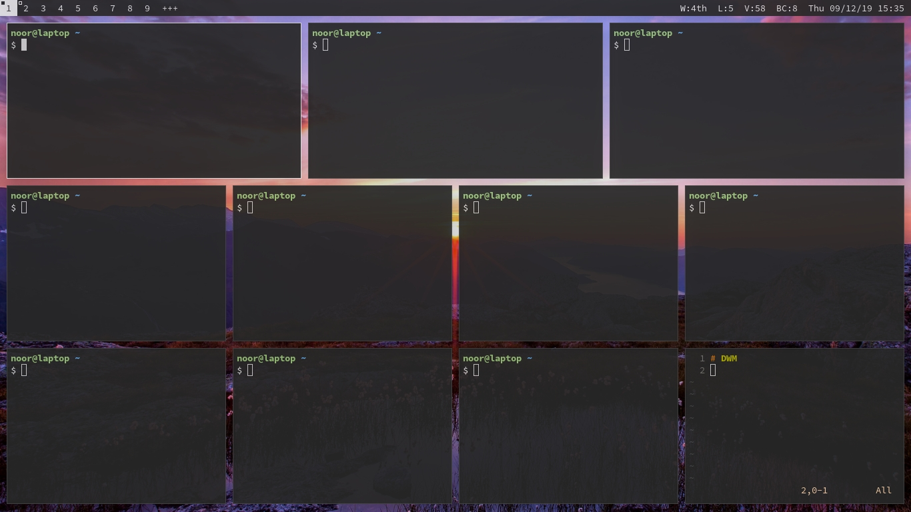

# Dotfiles

## Notes
I'm **not** using arch BTW! Rolling releases **break** my laptop! 

## List of program installed
- `dwm`, window manager.
- `dmenu`, program runner and more.
- `dunst`, notifier.
- `lf`, file manager.
- `st`, terminal emulator.
- `tmux`, terminal multiplexer.
- `vim`, text editor.
- `aria2`, download manager.
- `scrot`, screen capture.
- `feh`, image viewer.
- `mupdf`, document viewer.
- `ffmpeg`, input recorder.
- `cmus`, music player.
### Bloated zone
- `mpv`, video player.
- `firefox`, web browser.
### Utilities that make my life easier 
- `stow`, dotfiles manager.
- `git`, version control system.
- `cmake`, Makefile generator.
- `network-manager`, network manager.
- `trash-cli`, trash helper.
- `acpi`, hardware status information.
- `xbacklight`, (laptop only) brightness manager.
- `tlp`, (laptop only) and more minutes to live.
- `alsa`, sound device manager.
- `compton`, compositor.
- `xdg-open`, preferred program manager.
- `jmtpfs`, mtp manager.
- `rsync`, smart copy.
### Unnecessary stuff
- `pandoc`, document converter.
- `texlive`, latex compiler.

## Side notes
### Dwm
I'm moving from `openbox` to `dwm`. here's [my build](https://github.com/wachd/dwm)

### Vim
I was Using [vim-plug](//github.com/junegunn/vim-plug) to install all the `vim` plugin, but now in vim8 you can copy it manually from repo or anything to take controll everything, the plugin I'm using is just outdated `snipmate.vim` and color-scheme `gruvbox`.
