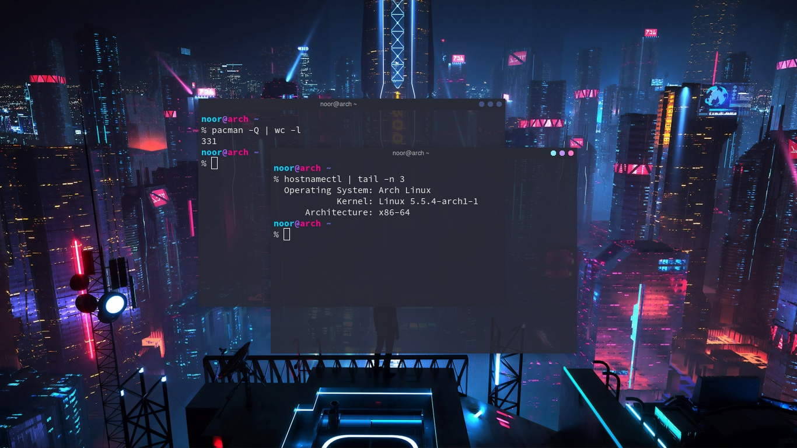

= Dotfiles
:author: Noor Wachid
:rev: 13

== Notes
I'm *not* using arch BTW! Rolling releases *break* my laptop! I am truly happy with Debian :). 

NOTE: BTW I use Arch right now! >:)

== List of Program Installed
[format="csv"]
|===
Window Manager, `openbox`
Terminal Emulator, `termite`
Text Editor, `neovim`
Notifier, `dunst`
File Manager, `nnn`
Download Manager, `aria2`
Screen Capture, `scrot`
Image Viewer, `feh`
PDF Reader, `zathura`
Recorder, `ffmpeg`
Media Player, `mpv`
Web Browser, `firefox`
Config Manager, `stow`
Version Controll, `git`
Network Manager, `netctl`
Hardware Info, `acpi`
Hardware Manager, `tlp`
Compositor, `compton`
MTP, `jmtpfs`
Sync, `rsync`
Fuzzy Finder, `fzf`
Finder, `fd`
Grep, `ripgrep`
File Progress, `progress`
|===

== Side Notes
=== Dwm
I'm moving from `openbox` to `dwm` back to `openbox` again. here's https://github.com/wachd/dwm::[my build].

=== NeoVim
I am using https://github.com/junegunn/vim-plug[vim-plug] to install all the `neovim` plugin.
