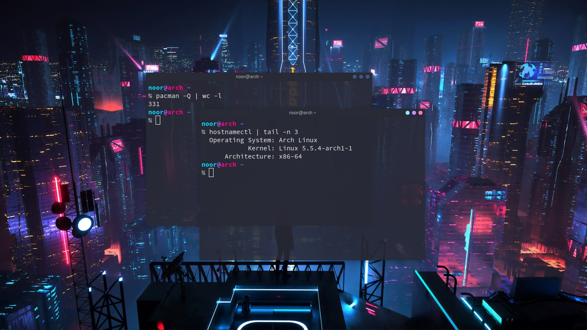

# Dotfiles

## Notes
I'm **not** using arch BTW! Rolling releases **break** my laptop! I am truly happy with Debian :). But like other fairytale my destiny brings me back to Arch.

## List of program installed
- `openbox`, window manager.
- `dunst`, notifier.
- `nnn`, file manager.
- `termite`, terminal emulator.
- `tmux`, terminal multiplexer.
- `vim`, text editor.
- `aria2`, download manager.
- `scrot`, screen capture.
- `feh`, image viewer.
- `mupdf`, document viewer.
- `ffmpeg`, input recorder.
- `cmus`, music player.
### Bloated zone
- `mpv`, video player.
- `firefox`, web browser.
### Utilities that make my life easier 
- `stow`, dotfiles manager.
- `git`, version control system.
- `netctl`, network manager.
- `acpi`, hardware status information.
- `tlp`, (laptop only) and more minutes to live.
- `compton`, compositor.
- `jmtpfs`, mtp manager.
- `rsync`, smart copy.

## Side notes
### Dwm
I'm moving from `openbox` to `dwm` back to `openbox` again. here's [my dwm build](https://github.com/wachd/dwm).

### Vim
I am using [vim-plug](//github.com/junegunn/vim-plug) to install all the `vim` plugin.
